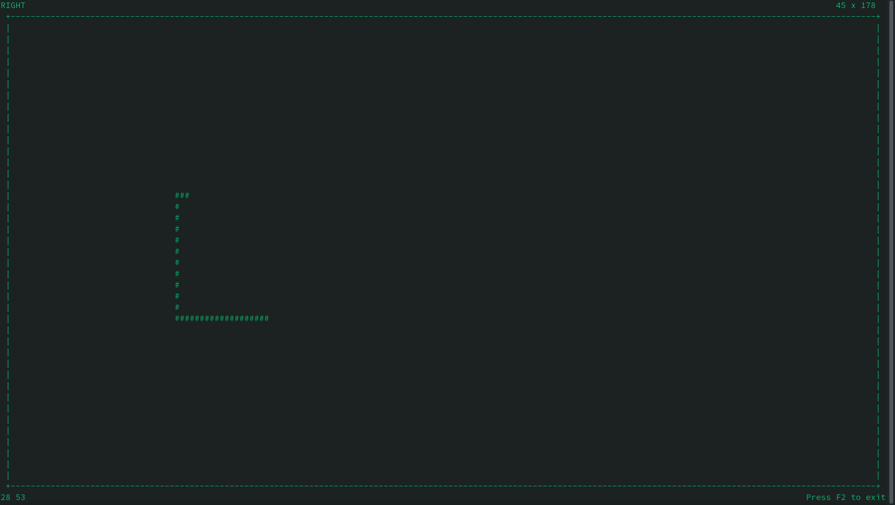
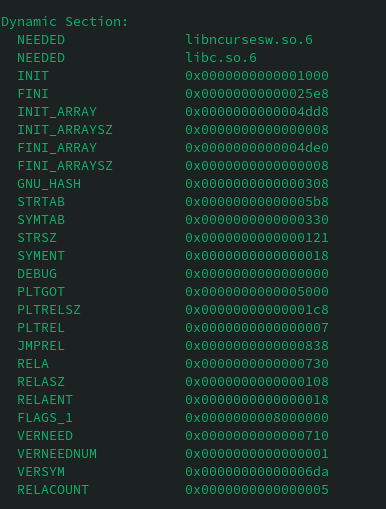
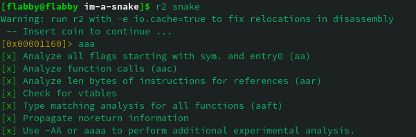
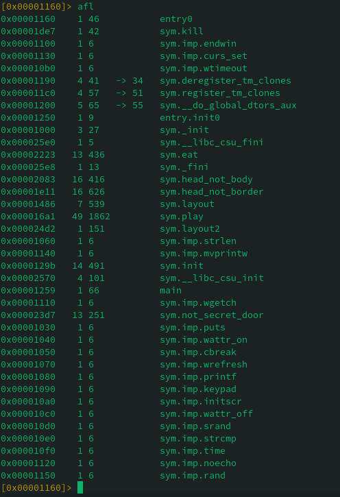
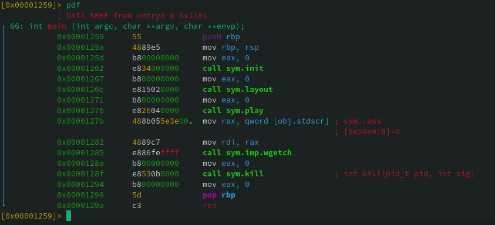
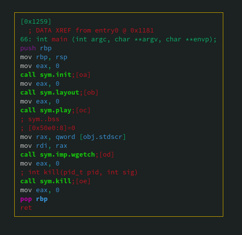
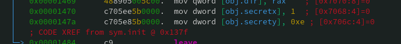
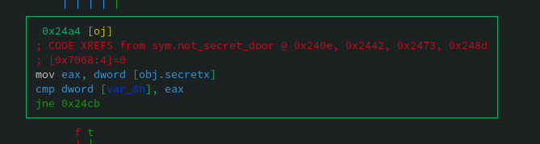
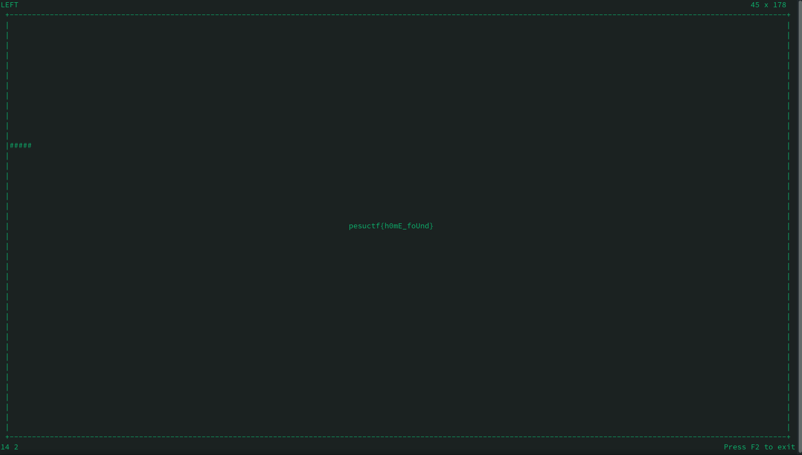

# I'm a snake
## Rev
### flabby

### description
>Went too far from home in search of food. food I found plenty, but was lost and did not know my way back. There was only 1 way back is all I know. Could you help me find my way back to my flag.. oops! I meant home! hehehe  

### solution

The challenge gives us a file called `snake` for this challenge. let's use `file` command to check what this file is  
```
$ file snake
./snake: ELF 64-bit LSB pie executable, x86-64, version 1 (SYSV), dynamically linked, interpreter /lib64/ld-linux-x86-64.so.2, BuildID[sha1]=1f9b40b596ee04f38768daeff442245263a4b2c8, for GNU/Linux 3.2.0, not stripped

```
An ELF 64-bit executable file which means we can execute it in the terminal.  
The program prompts us to keep a minimum screen size of 30x30.   
  
Executing it we see that it's a terminal based snake game, with randomly generated food. Playing the game does not do much adn does what is intended of a snake game. Hitting a wall or body reults in game over. On the top left is the direction prompt, top right is the current terminal size, bottom left current head position and bottom right is the prompt to press f2 at any moment to exit.  
These things can be identified easily by just playing for a few seconds.  
  
  
Before we start disassembling let's look at any extra library added into the executable with `objdump` command:
```
objdump -p snake
```
  

We can see that a library ncurses was included into the executable. Ncurses is a library often used for animations and manipulations. 
Let us now disassemble the program. I will be using radare2.  
The initial analysis will be done by the command `a`. for deep analysis we can add more 'a' flags like this:
  
  
since `aaa` is more than enough for our requirement we will be going with that.  
to list all analysed function we can use the command `afl`:  
  
  
We see that a function called `main` is available, let's go ahead and disassemble that. in order to do that we must first seek the main function and then disassemble the function. `pd` is a command to disassemble n bytes or n opcodes. since we'll be disassembling the whole function we can use `pdf` command:  
  
  
The same can be viewed in visual format, a feature of radare. This can be done using `VV` command. just enter `VV` into ur terminal prompt and hit enter:  
  
  
Nothing much going on here other than multiple function calls.  
the functions within main are:
```
sym.init
sym.layout
sym.play
sym.wgetch
sym.kill
```

we can disassemble each and check their code by seeking them first. Hit `q` twice to exit visual mode. once back in command line mode, we can disassemble init and see that this is a function just to initialise certain values and variables. most of it are standard within the ncurses module, a little research into the module will tell you that.  
Though a little observation towards the end of the function `init` reveals a hint:  
  
  
we can make use of this later. disassembling other functions in a similar manner tells us a lot about what is actually going on. The only interesting function though is `sym.play` where all the stuff happens. The function `sym.play` is one giant loop which checks if the snake's next move in the same direction is valid or not. the validity is checked using 3 other functions:  
```
head_not_body
head_not_border
not_secret_door
```
  
just overlooking the whole function has given us this info. there is no need to check in detail as we have found a lead already: `sym.not_secret_door`
  
let us now disassemble that. Upon disassembling it feels like there is a lot going on, though that is not the case. the very first block has a keyword "right" the one to the left botton of the first block has a keyword "left", and then "up" and "down". in each of these four blocks the direction of the snake is being checked. if the direction check results in true then there is manipulation being done to badyy and bodyx.  
basically these chunks of code are checking the next position of the snake if it continues in the same direction. All these chunks at the top lead to one chunk starting at adddress 0x24a4:  
  
  
this and the next chunk checks if the `bodyy` and `bodyx` have the same values as in `secrety` and `secretx`. If true then layout2 is called. we can continue further and check what layout2 function does. But instead since we know that `secretx` and `secrety` are the terminal co ordinates to the secret door or path and each had a value of 0x1 adn 0xe from the very first function `sym.init`  
  
  
we can test this out in the game itself, by coliding the snake to the door at 1,14 which is represented as `14 1` at the bottom left of the game layout.  


and voilla there's our flag.
>pesuctf{h0mE_foUnd}  

the same can be achieved by analysing layout2 function though the flag was split and saved as `pesuctf{h0mE_` and `n0t_foUnd}`. combining them we'd get `pesuctf{h0mE_n0t_foUnd}` which is not the flag. These variables were then manipulated using ncurses' builtin print function mv print to dump the actual flag upon playing.

### flag
>pesuctf{h0mE_foUnd}
